  

  <em>Curious by nature. Thoughtful in design. Always building.</em>

 

<strong>Languages &amp; Frameworks</strong>

  

  

<strong>DevOps &amp; Cloud</strong>

  

<strong>Monitoring &amp; Observability</strong>

  
  

<strong>Data, Machine Learning &amp; Tools</strong>

  

  
  
  
  

<!--
  PERSONALIZE ME
  Edit the skill IDs above at any time. Browse available icons at https://skillicons.dev.
-->
